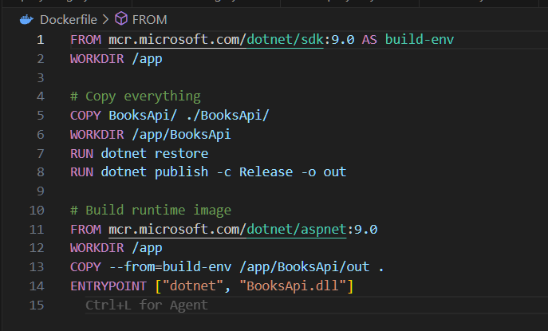
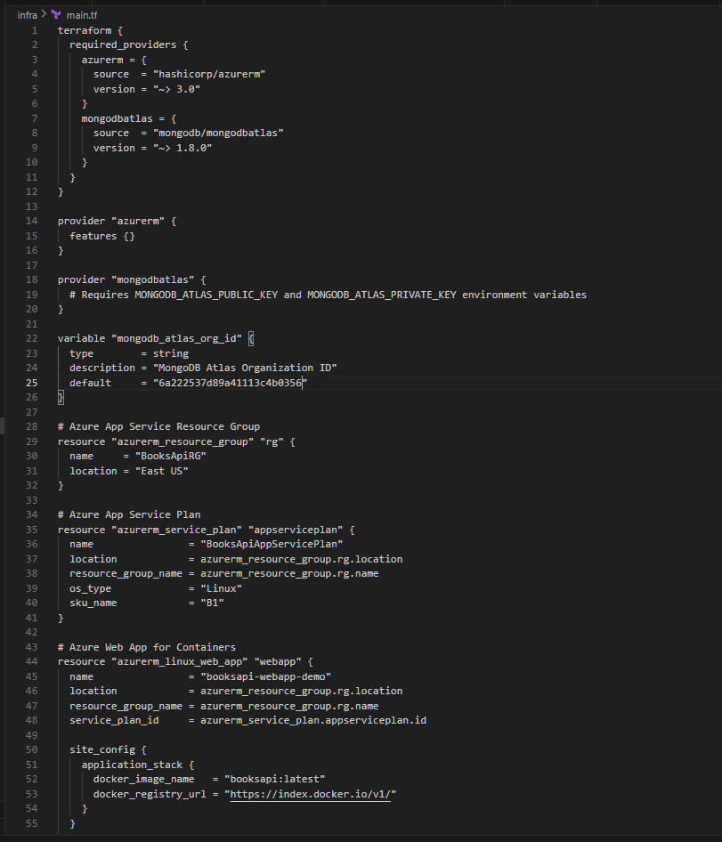
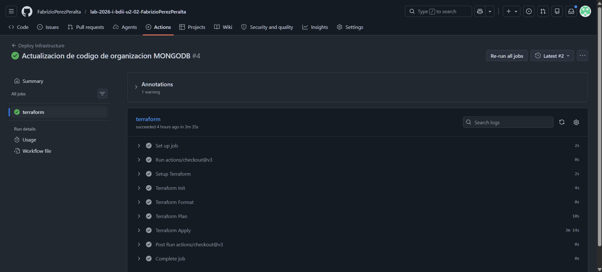
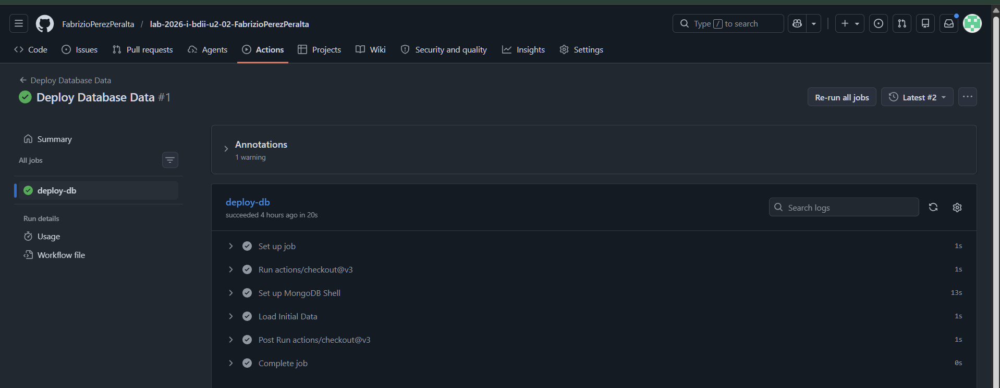
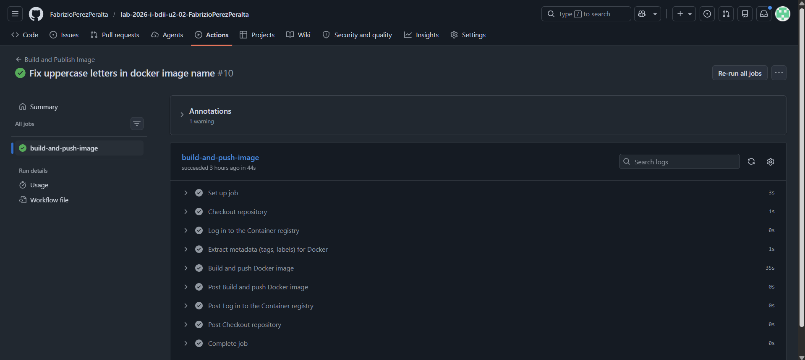
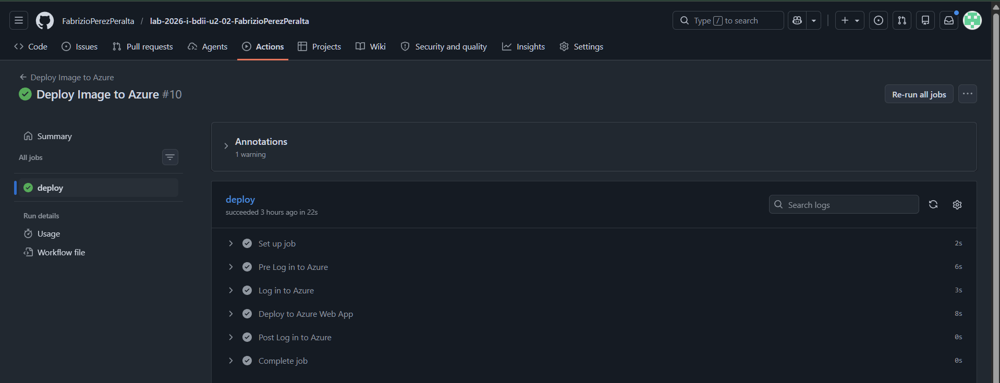

[](https://classroom.github.com/a/y9my6d6A)
[](https://classroom.github.com/open-in-codespaces?assignment_repo_id=24135359)
# SESION DE LABORATORIO N° 02: Generando un API utilizando una Base de Datos Documental (MongoDB)

### Nombre: Fabrizio Salvador Elias Perez Peralta

## OBJETIVOS
  * Comprender el funcionamiento de un motor de base de datos no relacional del tipo documental a través de su despliegue y uso.

## REQUERIMIENTOS
  * Conocimientos: 
    - Conocimientos básicos de gestión de base de datos de documentos
    - Conocimientos básicos de shell (linea de comandos).
  * Hardware:
    - Virtualization activada en el BIOS..
    - CPU SLAT-capable feature.
    - Al menos 4GB de RAM.
  * Software:
    - Windows 10 64bit: Pro, Enterprise o Education (1607 Anniversary Update, Build 14393 o Superior)
    - Docker Desktop 
    - Powershell versión 7.x
    - .Net 6 o superior

## CONSIDERACIONES INICIALES
  * Clonar el repositorio mediante git para tener los recursos necesaarios

## DESARROLLO

### PARTE I: Configuración de la base de datos

1. Iniciar la aplicación Docker Desktop:
2. Iniciar la aplicación Powershell o Windows Terminal en modo administrador 
3. Ejecutar el siguiente comando para iniciar una nueva instancia de una base de datos Mongo
```
docker run --name mongodb -d -p 27017:27017 mongo
```
4. Verificar sus ejecución y nombre con el siguiente comando. 
```
docker ps
```
deberá visualizar algo similar a:
```
CONTAINER ID   IMAGE     COMMAND                  CREATED              STATUS              PORTS                      NAMES
f293cca76b24   mongo     "docker-entrypoint.s…"   About a minute ago   Up About a minute   0.0.0.0:27017->27017/tcp   mongodb
```
5. Conectarse al gestor de base de datos mediante el siguiente comando:
```
docker exec -it mongodb mongosh
```
6. Crear la base de datos BookstoreDB, con el siguiente comando:
```
use BookstoreDb
```
7. Crear la colección Books, dentro de la base de datos:
```
db.createCollection('Books')
```
8. Insertar algunos datos de pruebas en la colección Books:
```
db.Books.insertMany([{'Name':'Design Patterns','Price':54.93,'Category':'Computers','Author':'Ralph Johnson'}, {'Name':'Clean Code','Price':43.15,'Category':'Computers','Author':'Robert C. Martin'}])
```
9. Verificar los datos ingresados mediante el siguiente comando:
```
db.Books.find({}).pretty()
```

### PARTE II: Creación del API

1. Iniciar la aplicación Powershell o Windows Terminal en modo administrador si es que no se tiene iniciada y ejecutar el siguiente comando:
```
dotnet new webapi -o BooksApi
```
2. Acceder a la carpeta recien creada y adicionar la libreria de Mongo para Net.
```
cd ./BooksApi/
dotnet add package MongoDB.Driver
```
3. Iniciar Visual Studio Code tomando como base la carpeta generada (BooksApi). Dentro del proyecto añadir el archivo Book.cs el cual tendrña la clase entidad, con el siguiente código
```C#
using MongoDB.Bson;
using MongoDB.Bson.Serialization.Attributes;

namespace BooksApi.Models
{
    public class Book
    {
        [BsonId]
        [BsonRepresentation(BsonType.ObjectId)]
        public string Id { get; set; }
        [BsonElement("Name")]
        public string BookName { get; set; }
        public decimal Price { get; set; }
        public string Category { get; set; }
        public string Author { get; set; }
    }
}
```
5. Ahora proceder a añadir la clase de configuración con el nombre de archivo BookStoreDatabaseSettings.cs e introducir el siguiente código:
```C#
namespace BooksApi.Models
{
    public class BookStoreDatabaseSettings
    {
        public string BooksCollectionName { get; set; }
        public string ConnectionString { get; set; }
        public string DatabaseName { get; set; }
    }
}
```
4. Modificar el archivo appsettings.json para que apunte a la base de datos local de datos, añadir:
```JSON
  "BookStoreDatabase": {
    "ConnectionString": "mongodb://127.0.0.1:27017",
    "DatabaseName": "BookstoreDb",
    "BooksCollectionName": "Books"
  },
```
5. Crear el archivo BookService.cs con el siguiente código:
```C#
using BooksApi.Models;
using Microsoft.Extensions.Options;
using MongoDB.Driver;

namespace BooksApi.Services;

public class BookService
{
    private readonly IMongoCollection<Book> _booksCollection;

    public BookService(
        IOptions<BookStoreDatabaseSettings> bookStoreDatabaseSettings)
    {
        var mongoClient = new MongoClient(
            bookStoreDatabaseSettings.Value.ConnectionString);

        var mongoDatabase = mongoClient.GetDatabase(
            bookStoreDatabaseSettings.Value.DatabaseName);

        _booksCollection = mongoDatabase.GetCollection<Book>(
            bookStoreDatabaseSettings.Value.BooksCollectionName);
    }

    public async Task<List<Book>> GetAsync() =>
        await _booksCollection.Find(_ => true).ToListAsync();

    public async Task<Book?> GetAsync(string id) =>
        await _booksCollection.Find(x => x.Id == id).FirstOrDefaultAsync();

    public async Task CreateAsync(Book newBook) =>
        await _booksCollection.InsertOneAsync(newBook);

    public async Task UpdateAsync(string id, Book updatedBook) =>
        await _booksCollection.ReplaceOneAsync(x => x.Id == id, updatedBook);

    public async Task RemoveAsync(string id) =>
        await _booksCollection.DeleteOneAsync(x => x.Id == id);
}
```
6. En el archivo Program.cs adicionar el siguiente código.
```C#
//Al inicio
using BooksApi.Models;
using BooksApi.Services;
...
// Add services to the container.
builder.Services.Configure<BookStoreDatabaseSettings>(builder.Configuration.GetSection("BookStoreDatabase"));
builder.Services.AddSingleton<BookService>();
```
7. Adicionalmente crear el archivo BooksController.cs en la carpeta Controllers con el siguiente código:
```C#
using BooksApi.Models;
using BooksApi.Services;
using Microsoft.AspNetCore.Mvc;

namespace BookStoreApi.Controllers;

[ApiController]
[Route("api/[controller]")]
public class BooksController : ControllerBase
{
    private readonly BookService _booksService;

    public BooksController(BookService booksService) =>
        _booksService = booksService;

    [HttpGet]
    public async Task<List<Book>> Get() {
        return await _booksService.GetAsync();
    }
    
    [HttpGet("{id:length(24)}")]
    public async Task<ActionResult<Book>> Get(string id)
    {
        var book = await _booksService.GetAsync(id);
        if (book is null) return NotFound();
        return book;
    }

    [HttpPost]
    public async Task<IActionResult> Post(Book newBook)
    {
        await _booksService.CreateAsync(newBook);
        return CreatedAtAction(nameof(Get), new { id = newBook.Id }, newBook);
    }

    [HttpPut("{id:length(24)}")]
    public async Task<IActionResult> Update(string id, Book updatedBook)
    {
        var book = await _booksService.GetAsync(id);

        if (book is null) return NotFound();
        updatedBook.Id = book.Id;
        await _booksService.UpdateAsync(id, updatedBook);
        return NoContent();
    }

    [HttpDelete("{id:length(24)}")]
    public async Task<IActionResult> Delete(string id)
    {
        var book = await _booksService.GetAsync(id);
        if (book is null) return NotFound();
        await _booksService.RemoveAsync(id);
        return NoContent();
    }
}
```
8. Iniciar un terminal en VS Code (CTRL+Ñ) o volver al terminal anteriomente abierto y ejecutar la aplicación con el comando:
```
dotnet run
```
9. Iniciar un navegador de internet e introducir la url http://localhost:XXXXX/swagger (donde XXXXX es el puerto donde esta eejcutandose la aplicación), una vez cargada la interfaz de Swagger, en el metodo Create, ingresar los siguientes datos y probar:
```JSON
{
  "id":"61a6058e6c43f32854e51f52",
  "bookName":"Clean Code",
  "price":43.15,
  "category":"Computers",
  "author":"Robert C. Martin"
}
```

---
## Actividades Encargadas

### 1. Genere el archivo Dockerfile para dockerizar el API creado.
El archivo fue creado en la raíz del proyecto usando el SDK de .NET 9.0.
```dockerfile
FROM mcr.microsoft.com/dotnet/sdk:9.0 AS build-env
WORKDIR /app

# Copy everything
COPY BooksApi/ ./BooksApi/
WORKDIR /app/BooksApi
RUN dotnet restore
RUN dotnet publish -c Release -o out

# Build runtime image
FROM mcr.microsoft.com/dotnet/aspnet:9.0
WORKDIR /app
COPY --from=build-env /app/BooksApi/out .
ENTRYPOINT ["dotnet", "BooksApi.dll"]
```
**Evidencia:**


### 2. Genere el archivo main.tf dentro de la carpeta infra, para crear mediante Terraform la infraestructura...
Se implementó la infraestructura como código configurando Azure App Service y el clúster de MongoDB Atlas.
```hcl
terraform {
  required_providers {
    azurerm = {
      source  = "hashicorp/azurerm"
      version = "~> 3.0"
    }
    mongodbatlas = {
      source  = "mongodb/mongodbatlas"
      version = "~> 1.8.0"
    }
  }
}

provider "azurerm" {
  features {}
}

provider "mongodbatlas" {
  # Requires MONGODB_ATLAS_PUBLIC_KEY and MONGODB_ATLAS_PRIVATE_KEY environment variables
}

variable "mongodb_atlas_org_id" {
  type        = string
  description = "MongoDB Atlas Organization ID"
  default     = "6a222537d89a41113c4b0356"
}

# Azure App Service Resource Group
resource "azurerm_resource_group" "rg" {
  name     = "BooksApiRG"
  location = "East US"
}

# Azure App Service Plan
resource "azurerm_service_plan" "appserviceplan" {
  name                = "BooksApiAppServicePlan"
  location            = azurerm_resource_group.rg.location
  resource_group_name = azurerm_resource_group.rg.name
  os_type             = "Linux"
  sku_name            = "B1"
}

# Azure Web App for Containers
resource "azurerm_linux_web_app" "webapp" {
  name                = "booksapi-webapp-demo"
  location            = azurerm_resource_group.rg.location
  resource_group_name = azurerm_resource_group.rg.name
  service_plan_id     = azurerm_service_plan.appserviceplan.id

  site_config {
    application_stack {
      docker_image_name   = "booksapi:latest"
      docker_registry_url = "https://index.docker.io/v1/"
    }
  }

  app_settings = {
    "WEBSITES_ENABLE_APP_SERVICE_STORAGE" = "false"
    "BookStoreDatabase__ConnectionString" = "mongodb+srv://..."
  }
}

# MongoDB Atlas Project
resource "mongodbatlas_project" "project" {
  name   = "BooksApiProject"
  org_id = var.mongodb_atlas_org_id
}

# MongoDB Atlas Cluster
resource "mongodbatlas_cluster" "cluster" {
  project_id   = mongodbatlas_project.project.id
  name         = "BooksApiCluster"
  cluster_type = "REPLICASET"

  provider_name               = "TENANT"
  backing_provider_name       = "AZURE"
  provider_region_name        = "US_EAST_2"
  provider_instance_size_name = "M0"
}
```
**Evidencia:**


### 3. Genere la automatización infra.yml, que despliegue la infraestructura.
Se configuró GitHub Actions para autenticarse en Azure y correr el comando `terraform apply`.
```yaml
name: Deploy Infrastructure

on:
  push:
    paths:
      - 'infra/**'
  workflow_dispatch:

jobs:
  terraform:
    runs-on: ubuntu-latest
    defaults:
      run:
        working-directory: infra
    steps:
    - uses: actions/checkout@v3

    - name: Setup Terraform
      uses: hashicorp/setup-terraform@v2

    - name: Terraform Init
      run: terraform init

    - name: Terraform Format
      run: terraform fmt -check

    - name: Terraform Plan
      run: terraform plan -input=false
      env:
        ARM_CLIENT_ID: ${{ secrets.ARM_CLIENT_ID }}
        ARM_CLIENT_SECRET: ${{ secrets.ARM_CLIENT_SECRET }}
        ARM_SUBSCRIPTION_ID: ${{ secrets.ARM_SUBSCRIPTION_ID }}
        ARM_TENANT_ID: ${{ secrets.ARM_TENANT_ID }}
        MONGODB_ATLAS_PUBLIC_KEY: ${{ secrets.MONGODB_ATLAS_PUBLIC_KEY }}
        MONGODB_ATLAS_PRIVATE_KEY: ${{ secrets.MONGODB_ATLAS_PRIVATE_KEY }}

    - name: Terraform Apply
      if: github.ref == 'refs/heads/main' && github.event_name == 'push'
      run: terraform apply -auto-approve -input=false
      env:
        ARM_CLIENT_ID: ${{ secrets.ARM_CLIENT_ID }}
        ARM_CLIENT_SECRET: ${{ secrets.ARM_CLIENT_SECRET }}
        ARM_SUBSCRIPTION_ID: ${{ secrets.ARM_SUBSCRIPTION_ID }}
        ARM_TENANT_ID: ${{ secrets.ARM_TENANT_ID }}
        MONGODB_ATLAS_PUBLIC_KEY: ${{ secrets.MONGODB_ATLAS_PUBLIC_KEY }}
        MONGODB_ATLAS_PRIVATE_KEY: ${{ secrets.MONGODB_ATLAS_PRIVATE_KEY }}
```
**Evidencia:**


### 4. Genere la automatización deploydb.yml, que permita cargar datos en su base de datos MongoDB.
El contenedor de Mongo cargó exitosamente los libros mediante GitHub Actions.
```yaml
name: Deploy Database Data

on:
  workflow_dispatch:

jobs:
  deploy-db:
    runs-on: ubuntu-latest
    steps:
    - uses: actions/checkout@v3

    - name: Set up MongoDB Shell
      run: |
        sudo apt-get install gnupg
        wget -qO - https://www.mongodb.org/static/pgp/server-6.0.asc | sudo apt-key add -
        echo "deb [ arch=amd64,arm64 ] https://repo.mongodb.org/apt/ubuntu focal/mongodb-org/6.0 multiverse" | sudo tee /etc/apt/sources.list.d/mongodb-org-6.0.list
        sudo apt-get update
        sudo apt-get install -y mongodb-mongosh

    - name: Load Initial Data
      env:
        MONGO_URI: ${{ secrets.MONGO_URI }}
      run: |
        mongosh $MONGO_URI --eval "
          use BookstoreDb;
          db.Books.insertMany([
            {'Name':'Design Patterns','Price':54.93,'Category':'Computers','Author':'Ralph Johnson'},
            {'Name':'Clean Code','Price':43.15,'Category':'Computers','Author':'Robert C. Martin'}
          ]);
        "
```
**Evidencia:**


### 5. Genere la automatización buildimage.yml para construir la imagen y publicarla como paquete.
```yaml
name: Build and Publish Image

on:
  push:
    branches: [ "main" ]
  workflow_dispatch:

env:
  REGISTRY: ghcr.io
  IMAGE_NAME: ${{ github.repository }}

jobs:
  build-and-push-image:
    runs-on: ubuntu-latest
    permissions:
      contents: read
      packages: write

    steps:
      - name: Checkout repository
        uses: actions/checkout@v3

      - name: Log in to the Container registry
        uses: docker/login-action@v2
        with:
          registry: ${{ env.REGISTRY }}
          username: ${{ github.actor }}
          password: ${{ secrets.GITHUB_TOKEN }}

      - name: Extract metadata (tags, labels) for Docker
        id: meta
        uses: docker/metadata-action@v4
        with:
          images: ${{ env.REGISTRY }}/${{ env.IMAGE_NAME }}

      - name: Build and push Docker image
        uses: docker/build-push-action@v4
        with:
          context: .
          push: true
          tags: ${{ steps.meta.outputs.tags }}
          labels: ${{ steps.meta.outputs.labels }}
```
**Evidencia:**


### 6. Genere la automatización deployimage.yml que despliegue la imagen en el servicio Web.
La API se desplegó con éxito y responde de manera pública a través de la nube.
```yaml
name: Deploy Image to Azure

on:
  workflow_run:
    workflows: ["Build and Publish Image"]
    types:
      - completed
  workflow_dispatch:

jobs:
  deploy:
    runs-on: ubuntu-latest
    if: ${{ github.event.workflow_run.conclusion == 'success' || github.event_name == 'workflow_dispatch' }}
    steps:
      - name: Log in to Azure
        uses: azure/login@v1
        with:
          creds: ${{ secrets.AZURE_CREDENTIALS }}

      - name: Deploy to Azure Web App
        uses: azure/webapps-deploy@v2
        with:
          app-name: 'booksapi-webapp-demo'
          images: 'ghcr.io/fabrizioperezperalta/lab-2026-i-bdii-u2-02-fabrizioperezperalta:main'
```
**Evidencia:**

